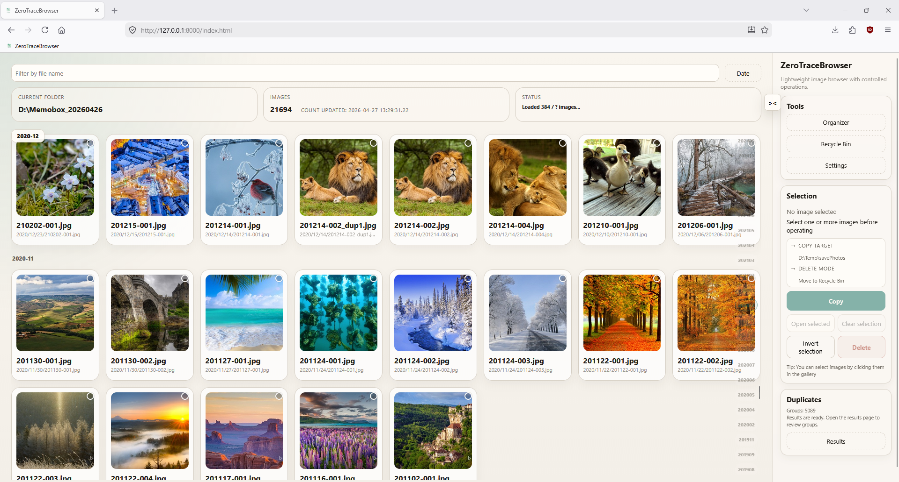
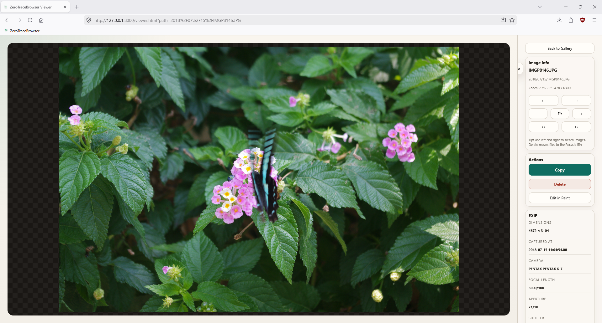
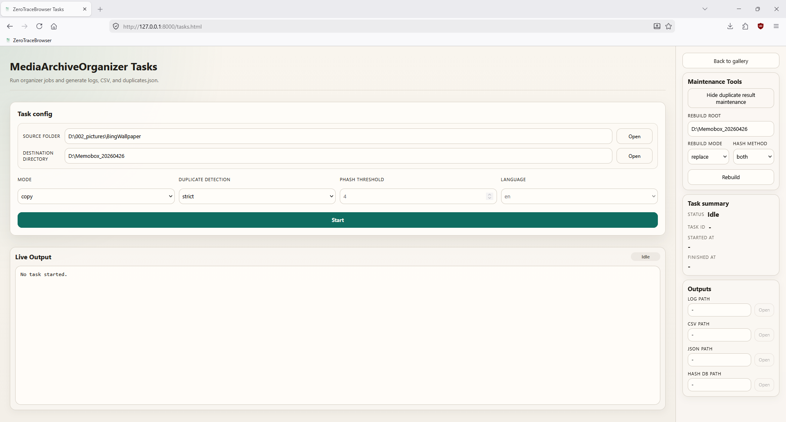
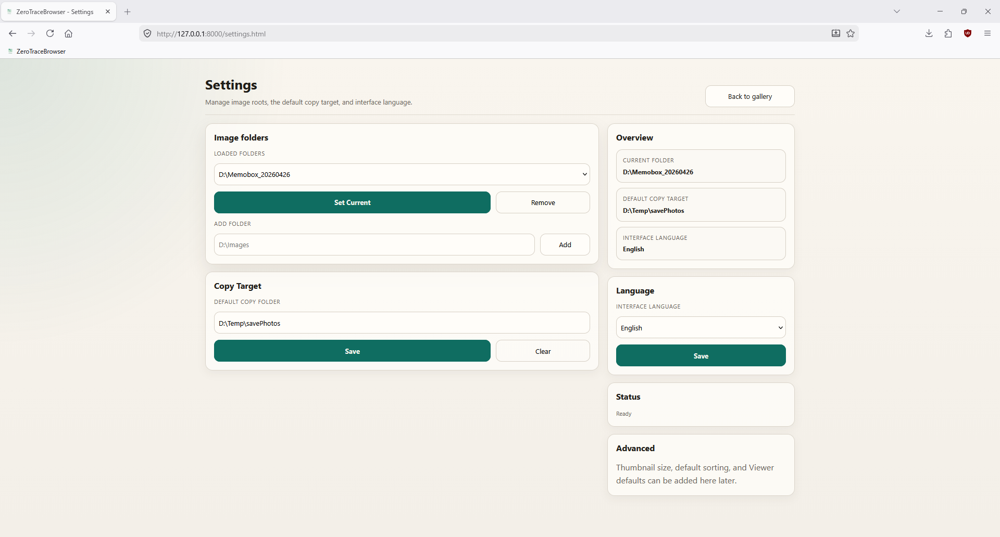
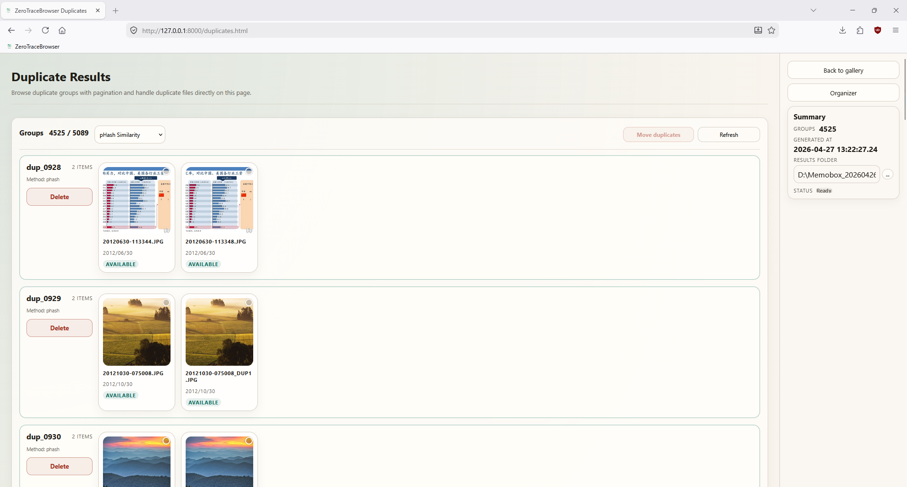
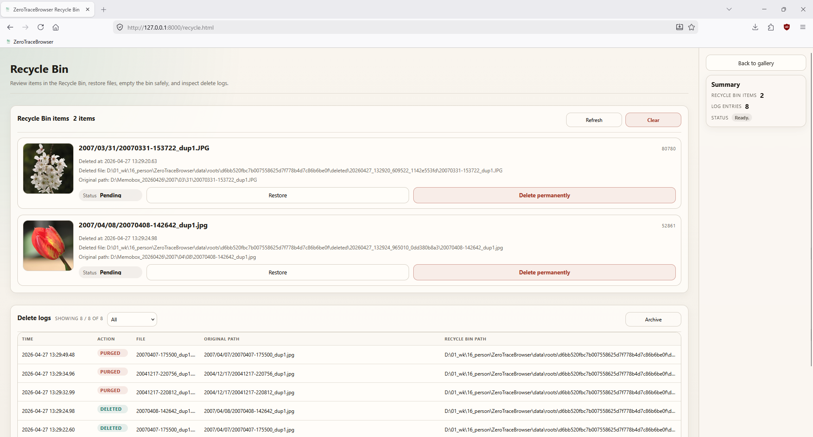

# ZeroTraceBrowser

> A lightweight, controlled, and recoverable local image browser and organizer.

---

## Overview

**ZeroTraceBrowser** is a local image browsing tool designed for engineers and advanced users.

It does not try to be an all-in-one media manager, and it does not make decisions on your behalf. Instead, it provides:

> **A predictable, controllable, and recoverable environment for local file operations.**

---

## Why ZeroTraceBrowser?

Many image management tools tend to introduce problems such as:

* Automatic organization that is hard to control
* Irreversible deletion risks
* Heavy and cluttered interfaces
* Hidden behavior that makes it difficult to understand what actually happened

**ZeroTraceBrowser takes the opposite approach:**

> It does not automate decisions for you. It gives you explicit control over file operations.

---

## Features

### Direct Local Folder Browsing

Browse images directly from the local file system. No import step and no cloud service required.

### Lightweight Design

* No heavy frontend framework
* Fast startup and responsive interaction
* Low resource usage

### Controlled Operations

Important operations must be explicitly triggered by the user:

* Copy
* Delete
* Batch operations

This keeps behavior predictable and reduces accidental actions.

### Safe Delete

Delete does not immediately remove the original file. Files are moved into ZeroTraceBrowser's app-level recycle area:

```text
Delete -> App recycle area -> Restore / Clean
```

### Duplicate Detection Support

The task system can generate:

* `duplicates.json`
* `duplicate_report.csv`

These outputs are intended for manual review and handling, not automatic deletion.

### Timeline Browsing

The gallery timeline uses backend-generated `timeline_time` / `timeline_ts` values for sorting and grouping. The frontend does not parse image dates on its own, which keeps timeline behavior consistent.

### Multi-language Support

* English
* Chinese
* Japanese

### Engineering-oriented Architecture

The project is organized into clear layers:

* Frontend: Vanilla JS (no framework)
* Backend: FastAPI + use-case pattern
* Data layer: isolated by image root (root_id)
* Analysis engine: MediaArchiveOrganizer (hash DB, duplicate detection)
* Every image root has its own workspace: `data/roots/<root_id>/`

---

## Screenshots

### Gallery



### Viewer



### Tasks



### Settings



### Duplicates



### Recycle



---

## Project Structure

```text
ZeroTraceBrowser/
├── app.py                      # FastAPI application entry point
├── requirements.txt            # Python dependencies
├── requirements-dev.txt        # Test dependencies
├── start.ps1                   # Startup script
├── test.ps1                    # Test script
├── pyproject.toml              # Project metadata

├── static/                     # Frontend assets
│   ├── *.html                  # index / viewer / tasks / recycle / duplicates / settings
│   ├── css/style.css
│   └── js/
│       ├── core/               # Shared frontend modules
│       ├── locales/            # Localization resources
│       └── pages/              # Page logic

├── core/                       # Backend core
│   ├── app/                    # Factory, lifespan, middleware
│   ├── config/                 # Paths, extensions, supported formats
│   ├── context.py              # Route context facade
│   ├── context_modules/        # Context modules (split by domain)
│   ├── domain/                 # Domain models: RootContext, ImageEntry, etc.
│   ├── infrastructure/         # File transfer, hashing, image processing
│   ├── repositories/           # Data access layer
│   ├── routes/                 # API route handlers
│   ├── schemas.py              # Pydantic request/response models
│   ├── security.py             # Path resolution and access control
│   ├── services/               # Business services
│   └── use_cases/              # Use-case layer (copy, delete, restore, etc.)

├── data/                       # Runtime data, isolated by image root
│   └── roots/<root_id>/
│       ├── root.json           # Root configuration
│       ├── deleted/            # App-level recycle area
│       ├── thumbnails/         # Thumbnail cache
│       ├── logs/               # Operation logs (CSV)
│       ├── indexes/            # Image index / timeline index
│       ├── tasks/              # Task scoped outputs
│       ├── hash_db.sqlite3     # Content hash database
│       └── duplicates.json     # Duplicate detection results

├── MediaArchiveOrganizer/      # Image analysis and organization engine
└── tests/                      # Tests
```

---

## Design Principles

### 1. Control over Automation

No automatic organization or automatic deletion. Every operation must be explicitly triggered by the user.

### 2. Safety over Raw Efficiency

Delete moves files into the app-level recycle area by default. Risky operations require explicit confirmation.

### 3. Simplicity over Feature Bloat

ZeroTraceBrowser focuses on the core workflow:

* Browse
* Filter
* Select
* Copy
* Safe delete
* Manual duplicate handling

### 4. Engineering over Magic

The system favors clear structure, explicit logic, maintainability, and predictable behavior.

---

## Installation and Run

### 1. Clone the Project

```powershell
git clone https://github.com/yourname/ZeroTraceBrowser.git
cd ZeroTraceBrowser
```

### 2. Create a Virtual Environment

```powershell
python -m venv venv
```

### 3. Install Dependencies

```powershell
.\venv\Scripts\python.exe -m pip install -r requirements.txt -r requirements-dev.txt

### 4. Start the Server

Recommended:

```powershell
.\start.ps1
```

Or run Uvicorn directly:

```powershell
.\venv\Scripts\python.exe -m uvicorn app:app --host 127.0.0.1 --port 8000
```

### 5. Open in Browser

```text
http://127.0.0.1:8000
```

---

## Tests

Recommended:

```powershell
.\test.ps1
```

Or run pytest directly:

```powershell
.\venv\Scripts\python.exe -m pytest -q
```

---

## Typical Workflow

1. Open the Settings page.
2. Add or switch the image root.
3. Configure the default copy target if needed.
4. Return to the Gallery page and browse images.
5. Select images and perform actions:
   * Copy to the target directory
   * Delete to the app-level recycle area
6. Restore or clean files on the Recycle page.
7. Generate Hash DB / duplicate results on the Tasks page.
8. Review and handle duplicate images manually on the Duplicates page.

---

## Supported Formats

The current version supports common local image formats, including:

* `.jpg` / `.jpeg`
* `.png`
* `.webp`
* `.bmp`
* `.gif`

---

## Runtime Data

ZeroTraceBrowser stores runtime data for each image root under `data/roots/<root_id>/`:

* Thumbnail cache (thumbnails/)
* Image index (indexes/)
* Timeline index (indexes/)
* Delete logs (logs/, CSV format)
* App-level recycle files (deleted/)
* Duplicate results (duplicates.json)
* Content hash database (hash_db.sqlite3)
* Task outputs (tasks/)

This data improves browsing speed, preserves operation history, and keeps state isolated between image roots. Original images remain in the image directories configured by the user.

---

## Notes

* Delete is a safe delete by default. Files are moved into ZeroTraceBrowser's app-level recycle area.
* The app-level recycle area is not the same as the Windows system Recycle Bin.
* Cleaning the recycle area or removing root history requires explicit user confirmation.
* Make sure the image root and copy target directories have the required read/write permissions.
* The current version is intended for local use. Do not expose it directly to the public internet.

---

## Roadmap

* [ ] AI-assisted tagging / classification suggestions without automatic moving or deletion
* [ ] Smarter duplicate analysis UI
* [ ] Rule-based batch operations
* [ ] Plugin extension system

---

## Positioning

ZeroTraceBrowser is not:

* Lightroom
* A cloud photo service
* An automatic organization tool

It is:

> An engineer-friendly tool focused on user control.

---

## License

MIT License

---

## Author's Note

The core idea of this project is simple:

> It does not automate decisions for you. It gives control back to you.

If you:

* Do not trust automatic deletion
* Dislike bloated interfaces
* Want full control over file operations

ZeroTraceBrowser is built for that kind of workflow.

---

## Support

If this project is useful to you, contributions are welcome:

* Star the project
* Open an issue
* Submit a pull request

---

> Control your files. Do not let the tool control them.
