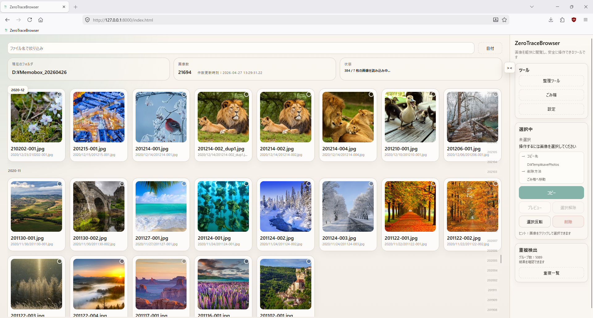
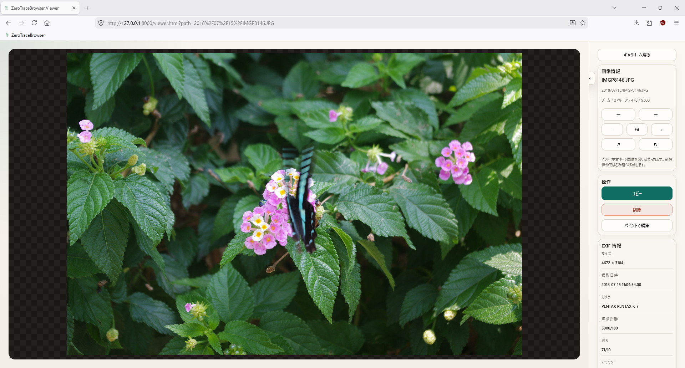
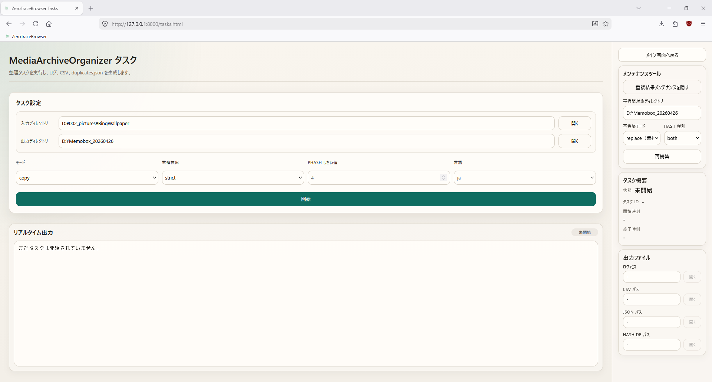
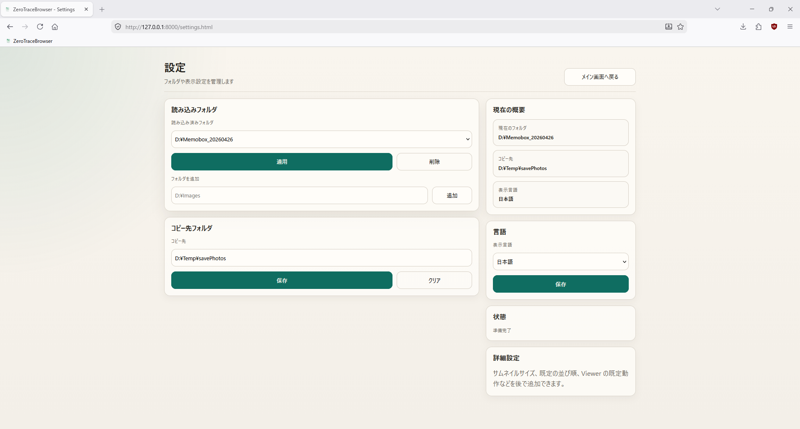
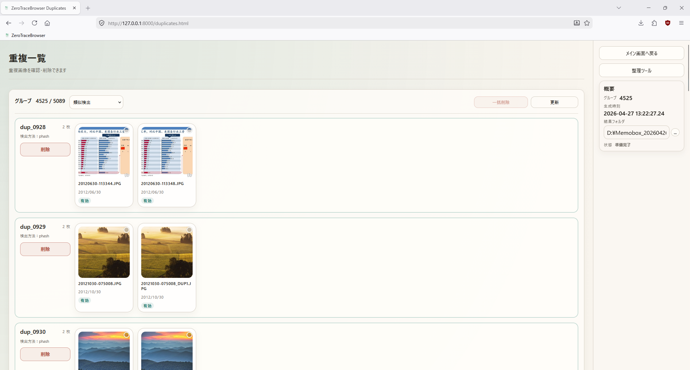
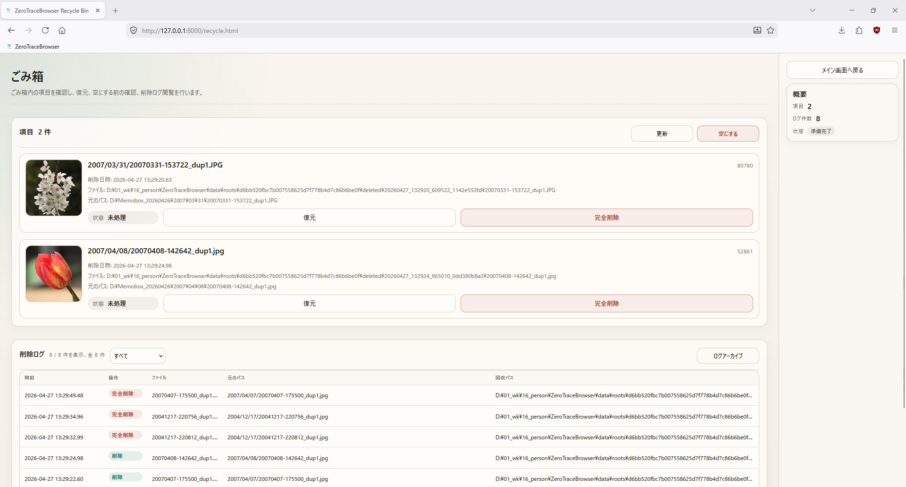

# ZeroTraceBrowser

> クラウドへのインポートも、誤削除のリスクもなく、ローカルの写真をそのまま閲覧・確認・整理できます。

---

## 概要

**ZeroTraceBrowser** は、エンジニアや上級ユーザー向けに設計されたローカル画像ブラウザです。

万能なメディア管理ツールを目指すものではなく、ユーザーの代わりに勝手な判断を行うこともしません。代わりに、次のような環境を提供します。

> **予測可能で、制御しやすく、復元可能なローカルファイル操作環境**

---

## なぜ ZeroTraceBrowser なのか

一般的な画像管理ツールでは、次のような問題が起こりがちです。

* 自動整理が強すぎて、フォルダ構成を制御しづらい
* 削除が取り返しのつかない操作になりやすい
* UI が複雑で重い
* 内部で何が起きたのか分かりにくい隠れた動作が多い

**ZeroTraceBrowser は、その逆を選びます。**

> ユーザーの代わりに判断せず、ファイル操作の主導権をユーザーに残します。

---

## 主な機能

### ローカルフォルダを直接参照

インポートやクラウドサービスは不要です。ローカルファイルシステム上の画像をそのまま閲覧できます。

### 軽量設計

* 重いフロントエンドフレームワークを使わない
* 起動が速く、操作も軽い
* リソース消費が少ない

### 明示的に制御された操作（Controlled Operations）

重要な操作は、必ずユーザーが明示的に実行します。

* コピー
* 削除
* 一括操作

これにより、誤操作を減らし、挙動を予測しやすくしています。

### 安全な削除（復元可能）

削除は、元ファイルを即座に消す操作ではありません。ファイルは ZeroTraceBrowser のアプリ内リサイクル領域へ移動されます。

```text
削除 -> アプリ内リサイクル領域 -> 復元 / クリーンアップ
```

### 重複画像検出のサポート

タスクシステムにより、次の結果を生成できます。

* `duplicates.json`
* `duplicate_report.csv`

これらは自動削除のためではなく、ユーザーが目視確認しながら重複画像を処理するための出力です。

重複検出には、次の 2 つの方式があります。

* **strict** — バイト単位の正確なハッシュ照合
* **phash** — 知覚ハッシュ照合（しきい値を設定可能、デフォルトは 4）

2 つの方式を 1 回のスキャンで組み合わせて使うこともできます。

### EXIF データの表示

ビューアでは、画像に埋め込まれた EXIF メタデータ（カメラモデル、撮影日時、GPS 座標など）を読み取り表示します。動画ファイルの場合はメディア種別の表示のみになります。

### システムエディタで開く

ビューアから任意の画像を、OS のデフォルトアプリケーション（フォト、ペイントなど）で直接開くことができます。ブラウザのタブを離れる必要はありません。

### タイムライン表示

ギャラリーのタイムラインは、バックエンドで生成された `timeline_time` / `timeline_ts` を使って並び替えとグルーピングを行います。フロントエンド側で画像日時を独自に解析しないため、タイムラインの挙動が一貫します。

### 多言語対応

* English
* 中文
* 日本語

### エンジニアリング志向の構成

プロジェクトは明確なレイヤーに分かれています。

* フロントエンド: Vanilla JS（フレームワークなし）
* バックエンド: FastAPI + use-case パターン
* データ層: 画像ルートごとに分離（各ルートに独立した workspace）
* 解析エンジン: MediaArchiveOrganizer（Hash DB / 重複検出）
* 各画像ルートが独立した作業領域: `data/roots/<root_id>/`

---

## 画面

### ギャラリー（Gallery）



### ビューア（Viewer）



### タスク管理（Tasks）



### 設定（Settings）



### 重複画像処理（Duplicates）



### リサイクル管理（Recycle）



---

## プロジェクト構成

```text
ZeroTraceBrowser/
├── app.py                      # FastAPI アプリケーション入口
├── requirements.txt            # Python 依存関係
├── requirements-dev.txt        # テスト依存関係
├── start.ps1                   # 起動スクリプト
├── test.ps1                    # テストスクリプト
├── pyproject.toml              # プロジェクトメタデータ

├── static/                     # フロントエンド資産
│   ├── *.html                  # index / viewer / tasks / recycle / duplicates / settings
│   ├── css/style.css
│   └── js/
│       ├── core/               # 共通フロントエンドモジュール
│       ├── locales/            # 多言語リソース
│       └── pages/              # ページごとのロジック

├── core/                       # バックエンド中核
│   ├── app/                    # アプリケーションファクトリ、ライフサイクル、ミドルウェア
│   ├── config/                 # パス、拡張子、対応フォーマット
│   ├── context.py              # ルートコンテキストインターフェース
│   ├── context_modules/        # コンテキストモジュール（ドメイン別に分割）
│   ├── domain/                 # ドメインモデル：RootContext、ImageEntry など
│   ├── infrastructure/         # ファイル転送、ハッシュ計算、画像処理
│   ├── repositories/           # データアクセス層
│   ├── routes/                 # API ルートハンドラ
│   ├── schemas.py              # Pydantic リクエスト/レスポンスモデル
│   ├── security.py             # パス解決とアクセス制御
│   ├── services/               # ビジネスサービス
│   └── use_cases/              # ユースケース層（コピー、削除、復元など）

├── data/                       # 実行時データ（画像ルートごとに分離）
│   └── roots/<root_id>/
│       ├── root.json           # ルート設定
│       ├── deleted/            # アプリ内リサイクル領域
│       ├── thumbnails/         # サムネイルキャッシュ
│       ├── logs/               # 操作ログ（CSV 形式）
│       ├── indexes/            # 画像インデックス / タイムラインインデックス
│       ├── tasks/              # タスク出力（タスク別）
│       ├── hash_db.sqlite3     # コンテンツハッシュデータベース
│       └── duplicates.json     # 重複画像検出結果

├── MediaArchiveOrganizer/      # 画像解析・整理エンジン
└── tests/                      # テスト
```

---

## 設計方針

### 1. 自動化より制御性

自動整理や自動削除は行いません。すべての操作はユーザーが明示的に実行します。

### 2. 効率より安全性

削除はデフォルトでアプリ内リサイクル領域へ移動します。リスクのある操作には明示的な確認を求めます。

### 3. 機能過多よりシンプルさ

ZeroTraceBrowser は、次の基本ワークフローに集中します。

* 閲覧
* フィルタリング
* 選択
* コピー
* 安全な削除
* 重複画像の手動処理

### 4. 魔法のような挙動より、明確な設計

明確な構造、明示的なロジック、保守しやすさ、予測可能な挙動を重視します。

---

## インストールと起動

### 1. プロジェクトをクローン

```powershell
git clone https://github.com/feilong-pixel/ZeroTraceBrowser.git
cd ZeroTraceBrowser
```

### 2. 仮想環境を作成

**Python 3.10 以上**が必要です。

```powershell
python -m venv venv
```

### 3. 依存関係をインストール

```powershell
.\venv\Scripts\python.exe -m pip install -r requirements.txt -r requirements-dev.txt
```

### 4. サーバーを起動

プロジェクト付属のスクリプトを使う方法を推奨します。

```powershell
.\start.ps1
```

Uvicorn を直接起動することもできます。

```powershell
.\venv\Scripts\python.exe -m uvicorn app:app --host 127.0.0.1 --port 8000
```

### 5. ブラウザで開く

```text
http://127.0.0.1:8000
```

---

## 環境変数

すべての変数はオプションです。未設定の場合、以下のデフォルト値が適用されます。

| 変数 | デフォルト | 説明 |
| --- | --- | --- |
| `ZTB_IMAGE_ROOT` | プロジェクトディレクトリ | 起動時に読み込むデフォルトの画像ルートディレクトリ |
| `ZTB_DEFAULT_COPY_TARGET` | _(空)_ | コピー操作のデフォルト保存先 |
| `ZTB_CORS_ORIGINS` | `http://127.0.0.1:8000` と localhost 変体 | 許可する CORS オリジンのカンマ区切りリスト |
| `ZTB_TRUSTED_HOSTS` | `localhost`、`127.0.0.1`、`::1` | 信頼するホスト名のカンマ区切りリスト |
| `ZTB_ALLOW_ARBITRARY_OPEN_PATH` | _(無効)_ | `1` または `true` を設定すると、設定済みのルート外のパスもシステムエディタで開けるようになります |

---

## テスト

プロジェクト付属のスクリプトを使う方法を推奨します。

```powershell
.\test.ps1
```

pytest を直接実行することもできます。

```powershell
.\venv\Scripts\python.exe -m pytest -q
```

---

## 基本的な使い方

1. Settings ページを開きます。
2. 画像ルートを追加、または切り替えます。
3. 必要に応じて、デフォルトのコピー先を設定します。
4. Gallery ページに戻り、画像を閲覧します。
5. 対象画像を選択して操作します。
   * コピー先ディレクトリへコピー
   * アプリ内リサイクル領域へ削除
6. Recycle ページでファイルを復元、またはクリーンアップします。
7. Tasks ページで Hash DB / 重複画像結果を生成します。
8. Duplicates ページで重複画像を目視確認し、手動で処理します。

---

## 対応形式

現在のバージョンでは、次の一般的なローカル画像形式をスキャンします。

* `.jpg` / `.jpeg`
* `.png`
* `.webp`
* `.bmp`
* `.gif`
* `.tiff`

動画ファイルも認識し、動画用のプレースホルダーサムネイルを表示します。

* `.mp4`
* `.webm`
* `.mov`
* `.m4v`
* `.avi`
* `.mkv`

Viewer では、ブラウザが直接再生できる場合に限り、`.mp4`、`.webm`、`.mov` の簡易プレビューに対応します。

動画対応には、トランスコード、字幕、再生速度や音声トラックの切り替え、プレイリスト、動画編集、コーデック互換のフォールバックは含まれません。

---

## 実行時データ

ZeroTraceBrowser は、各画像ルートに対応する実行時データを `data/roots/<root_id>/` に保存します。

* サムネイルキャッシュ（thumbnails/）
* 画像インデックス（indexes/）
* タイムラインインデックス（indexes/）
* 削除ログ（logs/、CSV 形式）
* アプリ内リサイクル領域のファイル（deleted/）
* 重複画像結果（duplicates.json）
* コンテンツハッシュデータベース（hash_db.sqlite3）
* タスク出力（tasks/）

これらのデータは、閲覧速度の向上、操作履歴の保持、画像ルートごとの状態分離に使われます。元画像は、ユーザーが設定した画像ディレクトリ内にそのまま残ります。

---

## 注意事項

* 削除はデフォルトで安全な削除として扱われ、ファイルは ZeroTraceBrowser のアプリ内リサイクル領域へ移動されます。
* アプリ内リサイクル領域は、Windows のシステムごみ箱とは別のものです。
* Windows 環境でアプリ内リサイクル領域のファイルを完全削除（パージ）すると、ファイルは即座に消去されるのではなく、Windows のシステムごみ箱へ送られます。それ以外のプラットフォームでは永続的に削除されます。
* リサイクル領域のクリーンアップや画像ルート履歴の削除には、ユーザーの明示的な確認が必要です。
* 画像ルートとコピー先ディレクトリには、必要な読み書き権限が必要です。
* 現在のバージョンはローカル利用を想定しています。公開インターネットへ直接公開しないでください。

---

## Roadmap

* [ ] AI によるタグ付け / 分類候補の提示（自動移動・自動削除はしない）
* [ ] より使いやすい重複画像分析 UI
* [ ] ルールベースの一括操作
* [ ] プラグイン拡張

---

## 位置づけ

ZeroTraceBrowser は次のようなものではありません。

* Lightroom
* クラウド写真サービス
* 自動整理ツール

ZeroTraceBrowser は次のようなツールです。

> ユーザーの制御権を重視する、エンジニア向けのローカル画像ブラウザ。

---

## License

MIT License

---

## 作者メモ

このプロジェクトの考え方はシンプルです。

> ユーザーの代わりに自動化するのではなく、ユーザーに制御権を返す。

もしあなたが次のように感じているなら、ZeroTraceBrowser はそのワークフローのために作られています。

* 自動削除を信用したくない
* 重い UI が苦手
* ファイル操作を自分で完全に管理したい

---

## サポート

このプロジェクトが役に立った場合は、次の形での協力を歓迎します。

* Star
* Issue の作成
* Pull Request の送信

---

## 現在の制限事項

* デスクトップ / ローカル専用
* インストーラーは未提供
* Python 環境が必要
* 動画プレビューは基本的なもののみ
* 重複画像の処理は手動
* AI タグ付け機能は未実装

---

## ステータス

現在のバージョン: v0.3.0

技術ユーザー向けの初期ローカルファースト版です。
パッケージ化されたデスクトップ版の提供は今後検討する予定です。

---

## こんな方に向いています

次の状況に当てはまる方に、ZeroTraceBrowser は役立ちます。

* 多くの写真をローカルフォルダ、外付けドライブ、NAS に保管している
* 写真をクラウドサービスにインポートしたくない
* ファイルを一枚ずつ開くのではなく、連続して閲覧したい
* 重複検出は必要だが、自動削除は信用できない
* 明示的で復元可能なファイル操作を好む

---

> ファイルを自分で制御する。ツールに制御されない。
