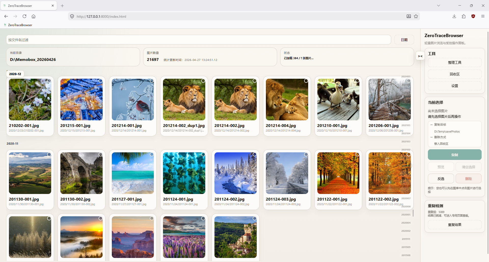
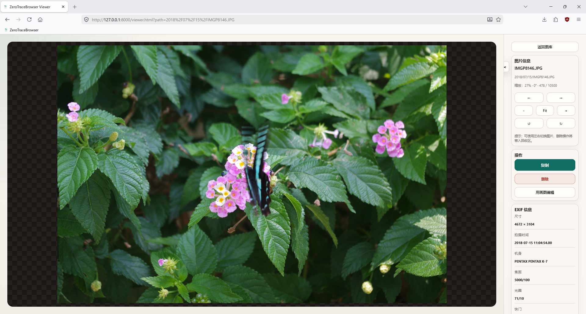
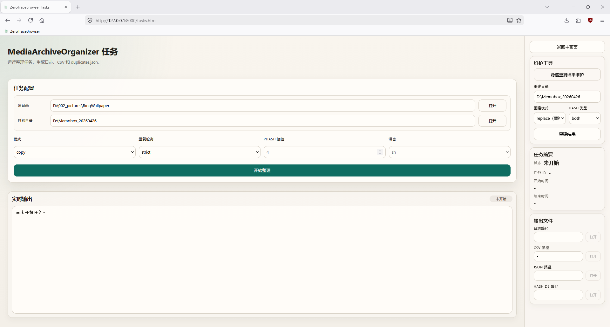
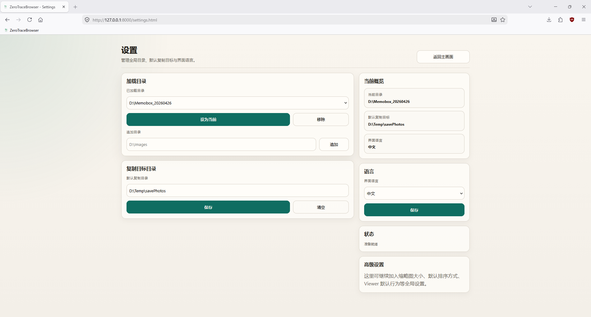
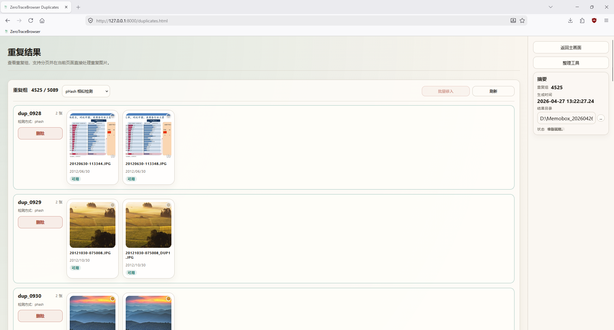
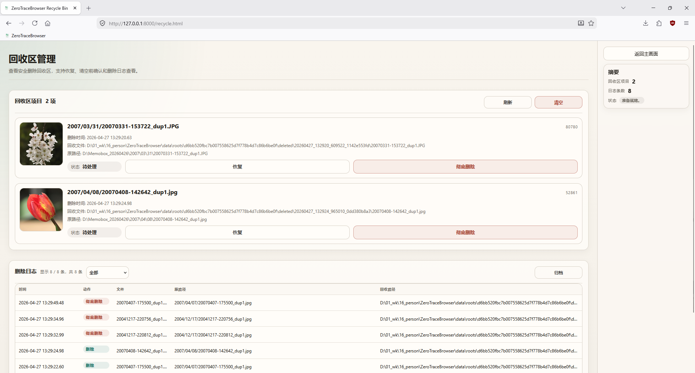

# ZeroTraceBrowser

> 一个轻量、可控、可恢复的本地图片浏览与整理工具。

---

## 项目简介

**ZeroTraceBrowser** 是一个面向工程师和高级用户设计的本地图片浏览工具。

它不追求“全能”，也不做“自动帮你决定”的事情，而是提供一个：

> **可预期、可控制、可恢复的文件操作环境**

---

## 为什么做这个项目？

现有图片管理工具普遍存在：

* 自动整理，不够可控
* 删除不可恢复，风险较高
* UI 复杂、臃肿
* 隐藏行为太多，用户难以判断实际发生了什么

而 **ZeroTraceBrowser** 的选择是：

> 放弃“自动替你做决定”，只提供“完全可控的操作能力”。

---

## 核心特性

### 本地目录直读

无需导入、无需云服务，直接基于本地文件系统浏览图片。

### 轻量化设计

* 无重型前端框架
* 启动快，响应快
* 占用资源低

### 受控操作（Controlled Operations）

所有关键操作必须由用户主动触发：

* 复制
* 删除
* 批量操作

避免误操作，行为完全可预期。

### 安全删除（可恢复）

删除不是直接移除文件，而是移动到 ZeroTraceBrowser 的应用内回收区：

```text
删除 -> 应用内回收区 -> 可恢复 / 可清理
```

### 重复图片检测支持

结合任务系统生成：

* `duplicates.json`
* `duplicate_report.csv`

用于人工判断和处理重复图片，而不是自动删除。

### 时间线浏览

图片时间线使用后端生成的 `timeline_time` / `timeline_ts`，按统一的时间来源排序和分组，避免前端自行解析时间造成不一致。

### 多语言支持

* English
* 中文
* 日本語

### 工程化架构

项目结构清晰分层：

* 前端（Vanilla JS，无框架）
* 后端（FastAPI + use-case 模式）
* 数据层（按图片根目录隔离，每个根有独立 workspace）
* 分析引擎（MediaArchiveOrganizer，哈希 DB / 重复检测）
* 每个图片根目录独立工作区：`data/roots/<root_id>/`

---

## 界面展示

### 图片浏览（Gallery）



### 图片查看（Viewer）



### 任务管理（Tasks）



### 设置（Settings）



### 重复图片处理（Duplicates）



### 回收区管理（Recycle）



---

## 项目结构

```text
ZeroTraceBrowser/
├── app.py                      # FastAPI 应用入口
├── requirements.txt            # Python 依赖
├── requirements-dev.txt        # 测试依赖
├── start.ps1                   # 启动脚本
├── test.ps1                    # 测试脚本
├── pyproject.toml              # 项目元数据

├── static/                     # 前端资源
│   ├── *.html                  # index / viewer / tasks / recycle / duplicates / settings
│   ├── css/style.css
│   └── js/
│       ├── core/               # 核心通用模块
│       ├── locales/            # 多语言资源
│       └── pages/              # 页面逻辑

├── core/                       # 后端核心
│   ├── app/                    # 应用工厂、生命周期、中间件
│   ├── config/                 # 路径、扩展名、支持格式
│   ├── context.py              # 路由上下文接口
│   ├── context_modules/        # 上下文模块（按领域拆分）
│   ├── domain/                 # 领域模型：RootContext、ImageEntry 等
│   ├── infrastructure/         # 文件传输、哈希计算、图片处理
│   ├── repositories/           # 数据访问层
│   ├── routes/                 # API 路由
│   ├── schemas.py              # Pydantic 请求/响应模型
│   ├── security.py             # 路径解析与访问控制
│   ├── services/               # 业务服务
│   └── use_cases/              # Use-case 层（复制、删除、恢复等）

├── data/                       # 运行数据（按图片根目录隔离）
│   └── roots/<root_id>/
│       ├── root.json           # 根目录配置
│       ├── deleted/            # 应用内回收区
│       ├── thumbnails/         # 缩略图缓存
│       ├── logs/               # 操作日志（CSV 格式）
│       ├── indexes/            # 图片索引 / 时间线索引
│       ├── tasks/              # 任务输出（按任务隔离）
│       ├── hash_db.sqlite3     # 内容哈希数据库
│       └── duplicates.json     # 重复图片检测结果

├── MediaArchiveOrganizer/      # 图片分析与整理引擎
└── tests/                      # 测试
```

---

## 设计理念

### 1. 可控优先，而不是自动化

拒绝“自动整理 / 自动删除”。所有操作必须由用户明确触发。

### 2. 安全优先，而不是效率优先

删除默认进入应用内回收区。高风险操作需要明确确认。

### 3. 简洁优先，而不是功能堆叠

只保留最核心能力：

* 浏览
* 筛选
* 选择
* 复制
* 安全删除
* 重复图片人工处理

### 4. 工程思维，而不是魔法行为

结构清晰、逻辑明确，强调可维护性与可扩展性。

---

## 安装与运行

### 1. 克隆项目

```powershell
git clone https://github.com/yourname/ZeroTraceBrowser.git
cd ZeroTraceBrowser
```

### 2. 创建虚拟环境

```powershell
python -m venv venv
```

### 3. 安装依赖

```powershell
.\venv\Scripts\python.exe -m pip install -r requirements.txt -r requirements-dev.txt
```

### 4. 启动服务

推荐使用项目脚本：

```powershell
.\start.ps1
```

也可以直接运行：

```powershell
.\venv\Scripts\python.exe -m uvicorn app:app --host 127.0.0.1 --port 8000
```

### 5. 打开浏览器

```text
http://127.0.0.1:8000
```

---

## 测试

推荐使用项目脚本：

```powershell
.\test.ps1
```

也可以直接运行：

```powershell
.\venv\Scripts\python.exe -m pytest -q
```

---

## 使用流程

1. 打开 Settings 页面。
2. 添加或切换图片根目录。
3. 按需设置默认复制目标目录。
4. 返回 Gallery 浏览图片。
5. 选择目标图片并执行操作：
   * 复制到目标目录
   * 删除到应用内回收区
6. 在 Recycle 页面恢复或清理文件。
7. 在 Tasks 页面生成 Hash DB / 重复图片结果。
8. 在 Duplicates 页面人工检查并处理重复图片。

---

## 当前支持格式

当前版本支持常见本地图片格式，包括：

* `.jpg` / `.jpeg`
* `.png`
* `.webp`
* `.bmp`
* `.gif`

---

## 运行数据说明

ZeroTraceBrowser 会在 `data/roots/<root_id>/` 下保存每个图片根目录对应的运行数据：

* 缩略图缓存（thumbnails/）
* 图片索引（indexes/）
* 时间线索引（indexes/）
* 删除日志（logs/，CSV 格式）
* 应用内回收区文件（deleted/）
* 重复图片结果（duplicates.json）
* 内容哈希数据库（hash_db.sqlite3）
* 任务输出（tasks/）

这些数据用于提升浏览速度、保存操作历史和隔离不同图片根目录的状态。原始图片仍保存在用户配置的图片目录中。

---

## 注意事项

* 删除为安全删除，默认移动到 ZeroTraceBrowser 的应用内回收区。
* 应用内回收区与 Windows 系统回收站不是同一个概念。
* 清理回收区、移除目录历史数据等操作会要求用户明确确认。
* 请确保图片根目录和复制目标目录具有必要的读写权限。
* 当前版本建议用于本地环境，不建议直接暴露到公网。

---

## Roadmap

* [ ] AI 辅助标注 / 分类建议（不自动移动、不自动删除）
* [ ] 更智能的重复图片分析 UI
* [ ] 批量规则操作（规则引擎）
* [ ] 插件化扩展能力

---

## 项目定位

ZeroTraceBrowser 不是：

* Lightroom
* 云相册
* 自动整理工具

它是：

> 一个强调“控制权”的工程师工具。

---

## License

MIT License

---

## 作者说明

这个项目的核心理念只有一句话：

> 不替你自动化，只把控制权交给你。

如果你也：

* 不信任自动删除
* 讨厌臃肿 UI
* 希望完全掌控文件操作

那这个项目就是为你准备的。

---

## 支持项目

如果对你有帮助，欢迎：

* Star
* 提 Issue
* 提 PR

---

> 控制你的文件，而不是被工具控制。
